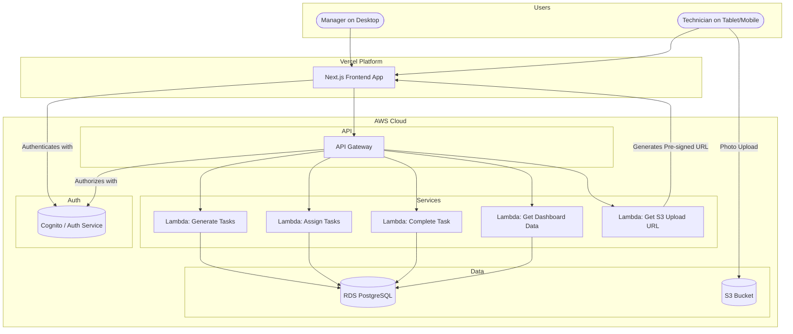

## **Automated Fleet Maintenance Management System Fullstack Architecture Document**

### **1. Introduction**

This document outlines the complete fullstack architecture for the Automated Fleet Maintenance Management System. It covers the backend services, frontend implementation, infrastructure, and the integration between them, based on the requirements and technical assumptions defined in the PRD.

*   **Starter Template:** N/A - Greenfield project. We will establish the structure from scratch based on modern best practices.


### **2. High Level Architecture**

#### **Technical Summary**

The system will be a modern, serverless full-stack application built within a TypeScript monorepo. The frontend will be a responsive Next.js application hosted on Vercel, providing an optimal user experience for both managers on desktops and technicians on mobile devices. The backend will consist of serverless Node.js functions running on AWS Lambda, communicating with a PostgreSQL database and using S3 for file storage. This architecture prioritizes scalability, low operational overhead, and rapid development, directly supporting the PRD's goals for a reliable and efficient MVP.

#### **Platform and Infrastructure Choice**

*   **Platform:** A hybrid approach using Vercel and AWS. Vercel for the frontend and CI/CD, and AWS for backend services and data storage.
*   **Key Services:**
    *   **Vercel:** Frontend hosting, CI/CD, Edge Network.
    *   **AWS Lambda:** Backend serverless compute.
    *   **Amazon RDS (PostgreSQL):** Relational database.
    *   **Amazon S3:** Asynchronous photo and file storage.
    *   **Amazon Cognito (or similar JWT provider):** Authentication.
*   **Deployment Host and Regions:** Vercel (Global Edge Network), AWS (e.g., us-east-1).

#### **Repository Structure**

*   **Structure:** Monorepo.
*   **Monorepo Tool:** Turborepo for build caching and task orchestration over npm workspaces.
*   **Package Organization:** An `apps/` directory for the Next.js frontend and the serverless backend, and a `packages/` directory for shared code (TypeScript types, UI components, config).

#### **High Level Architecture Diagram**



### **3. Tech Stack**

| Category | Technology | Version | Purpose | Rationale |
| :--- | :--- | :--- | :--- | :--- |
| Frontend Language | TypeScript | ~5.x | Type safety for UI | Reduces runtime errors, improves developer experience. |
| Frontend Framework | Next.js (React) | ~14.x | App Router, SSR, SSG | High performance, excellent developer experience, Vercel native. |
| UI Component Library | Shadcn/ui | latest | Accessible component primitives | Headless, customizable, accessible components built on Tailwind. |
| State Management | Zustand | ~4.x | Minimal global state | Simple, unopinionated state management for auth status, etc. |
| Backend Language | TypeScript | ~5.x | Type safety for API | Consistent language across the stack, robust code. |
| Backend Runtime | Node.js | 20.x (LTS) | Serverless function runtime | Standard for serverless TypeScript, excellent performance. |
| API Style | REST | N/A | API communication | Well-understood, stateless, and perfect for this domain. |
| Database | PostgreSQL | 16.x | Relational data store | Robust, reliable, and handles relational data effectively. |
| ORM | Prisma | ~5.x | Database access & migrations | Modern, type-safe ORM that simplifies database interactions. |
| File Storage | AWS S3 | N/A | Storing photo uploads | Scalable, secure, and cost-effective object storage. |
| Authentication | NextAuth.js | ~5.x | Handle user sessions | Simplifies authentication flows in Next.js. |
| Frontend Testing | Vitest + React Testing Library | latest | Component unit testing | Fast, modern testing framework for UI components. |
| E2E Testing | Playwright | latest | Critical path user flow testing | Robust E2E testing for the technician form submission. |
| Build Tool | Turborepo | latest | Monorepo task runner | Caches builds/tests to speed up CI/CD and local dev. |
| IaC Tool | AWS CDK | ~2.x | Infrastructure as Code | Define infrastructure using TypeScript for consistency. |
| CI/CD | Vercel | N/A | Continuous deployment | Native integration with Next.js, automated CI/CD from Git. |
| Logging | Pino | ~8.x | Structured backend logging | High-performance, structured JSON logging. |
| CSS Framework | Tailwind CSS | ~3.x | Utility-first styling | Rapid and consistent UI development. |

### **4. Data Models (TypeScript Interfaces)**

These interfaces will be defined in the `packages/shared/src/types` directory.

```typescript
// packages/shared/src/types/index.ts

export interface Vehicle {
  id: string; // e.g., "TRK-001"
  type: 'Truck' | 'Van' | 'Motorcycle' | 'Car';
  locationBase: string; // e.g., "Depot A"
  mileage: number;
  lastServiceDate: Date;
  serviceInterval: 'Weekly' | 'Bi-weekly' | 'Monthly';
}

export interface Technician {
  id: string;
  name: string;
  locationBase: string;
}

export interface Part {
  id: string;
  name: string; // e.g., "Oil filter"
}

export type TaskStatus = 'Pending Assignment' | 'Assigned' | 'In Progress' | 'Completed' | 'Unassigned - Awaiting Capacity' | 'Overdue';

export interface MaintenanceTask {
  id: string;
  vehicleId: string;
  technicianId?: string;
  dueDate: Date;
  status: TaskStatus;
  beforePhotoUrl?: string;
  afterPhotoUrl?: string;
  signature?: string;
  completedAt?: Date;
}

export interface PartsLog {
  id: string;
  taskId: string;
  partId: string;
  quantity: number;
}
```

### **5. API Specification (OpenAPI 3.0 Summary)**

A full OpenAPI spec will be generated, but here are the key endpoints:

```yaml
# apps/backend/openapi.yaml
openapi: 3.0.0
info:
  title: Fleet Maintenance API
  version: 1.0.0
paths:
  /api/health:
    get:
      summary: Health check
  /api/tasks/generate:
    post:
      summary: (Manager) Triggers monthly task generation & assignment.
  /api/tasks/my-tasks:
    get:
      summary: (Technician) Gets all tasks assigned to the current user.
  /api/tasks/{taskId}/complete:
    post:
      summary: (Technician) Submits a completed maintenance form.
  /api/dashboard:
    get:
      summary: (Manager) Gets all aggregated data for the dashboard.
  /api/uploads/presigned-url:
    post:
      summary: (Technician) Gets a pre-signed URL for uploading a photo to S3.
```

### **6. Unified Project Structure (Monorepo)**

```
fleet-maintenance-system/
├── apps/
│   ├── web/                # Next.js Frontend App
│   │   ├── app/              # App Router pages & components
│   │   ├── components/       # UI components (Shadcn)
│   │   └── lib/              # Helper functions, API client
│   └── backend/            # AWS Lambda Backend
│       ├── src/
│       │   ├── functions/    # Lambda function handlers
│       │   ├── services/     # Business logic (task gen, assignment)
│       │   └── lib/          # Shared backend utils (db client, logger)
│       └── cdk.ts            # Infrastructure definition
├── packages/
│   ├── shared/             # Shared code between apps
│   │   └── src/
│   │       └── types/        # TypeScript interfaces (from Section 4)
│   ├── config/             # Shared configs
│   │   ├── eslint/
│   │   └── typescript/
│   └── ui/                 # (Optional) Shared React component library
├── prisma/                 # Prisma schema and migrations
│   ├── schema.prisma
│   └── migrations/
├── package.json
└── turborepo.json
```

### **7. Deployment Architecture**

*   **Frontend Deployment:** The `apps/web` Next.js application will be connected to a Vercel project. Every `git push` to the `main` branch will trigger a production build and deployment on Vercel's global edge network.
*   **Backend Deployment:** The `apps/backend` infrastructure is defined using AWS CDK. The Vercel CI/CD pipeline will be configured to run `cdk deploy` when changes are detected in the `apps/backend` directory, deploying the Lambda functions and API Gateway.
*   **Database:** The RDS instance will be managed via the CDK but will be provisioned once and persisted across deployments. Database migrations (using `prisma migrate deploy`) will be a step in the backend deployment pipeline.

### **8. Security and Performance**

*   **Security:**
    *   Authentication will be handled by NextAuth.js, using JWTs.
    *   API Gateway will be configured to use a JWT authorizer to protect all backend endpoints.
    *   All S3 uploads will use short-lived pre-signed URLs to ensure security.
    *   Prisma will be used to prevent SQL injection vulnerabilities.
    *   All user input will be validated on the backend.
*   **Performance:**
    *   Next.js frontend will be highly optimized by Vercel's edge network and caching.
    *   The dashboard API will be a single, aggregated call to reduce network latency.
    *   Asynchronous photo uploads to S3 will not block UI form submission.
    *   Database queries for the dashboard will be optimized with proper indexing.
